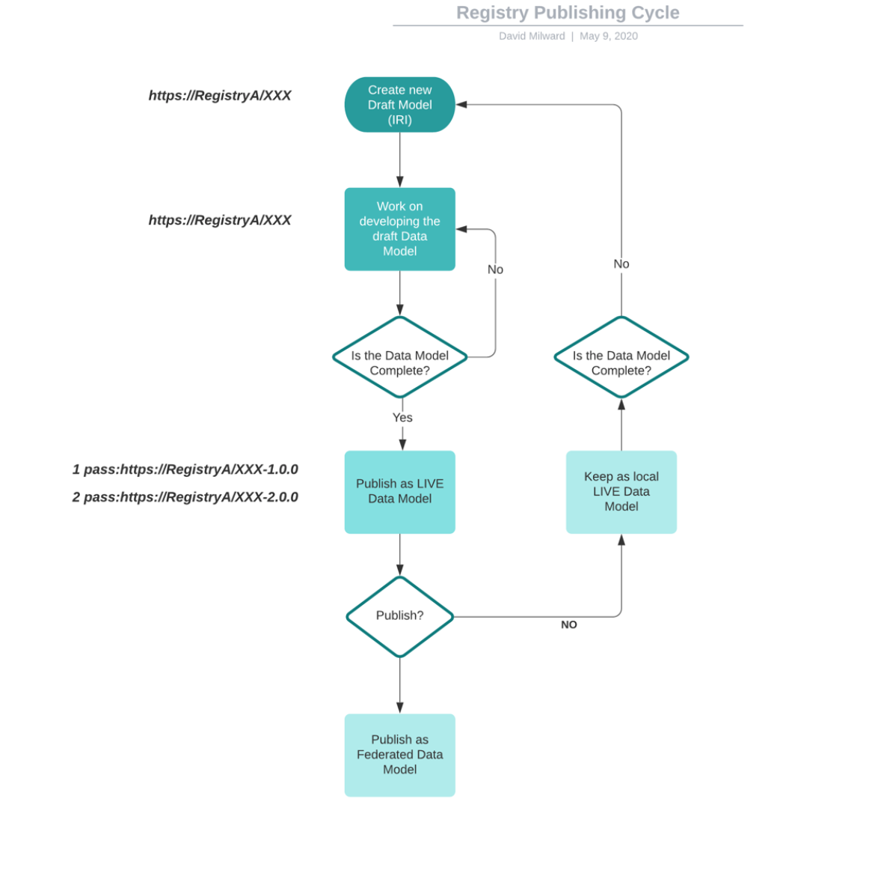
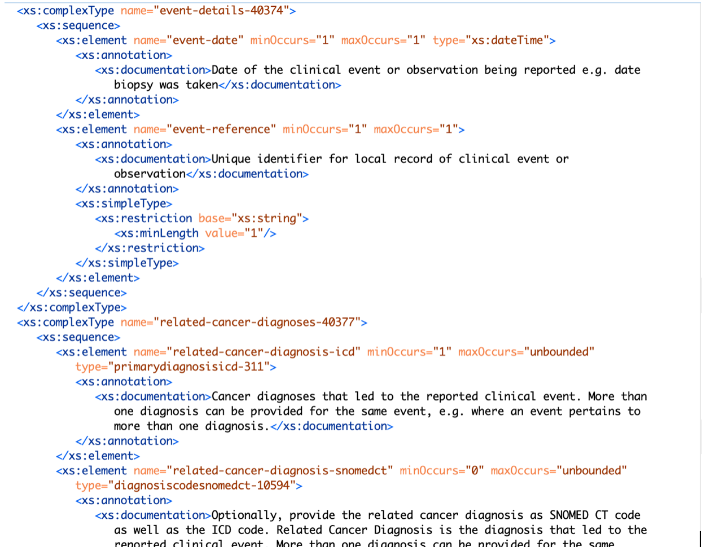
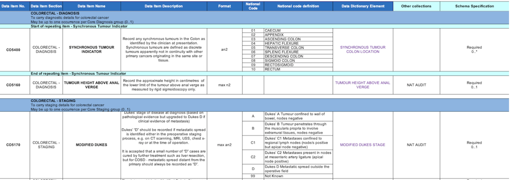
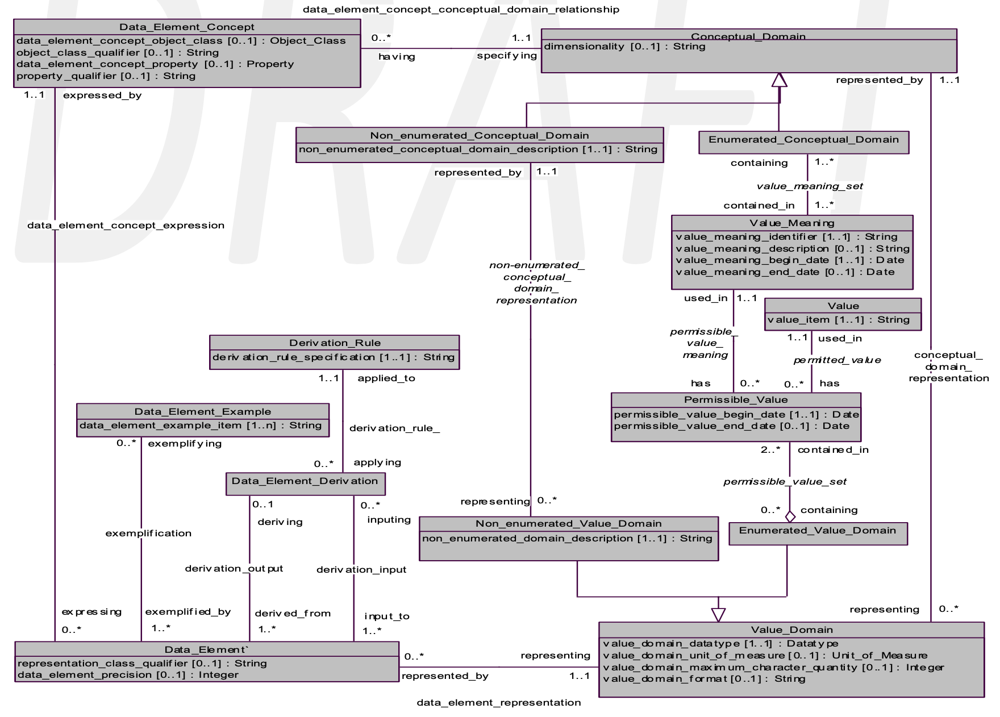
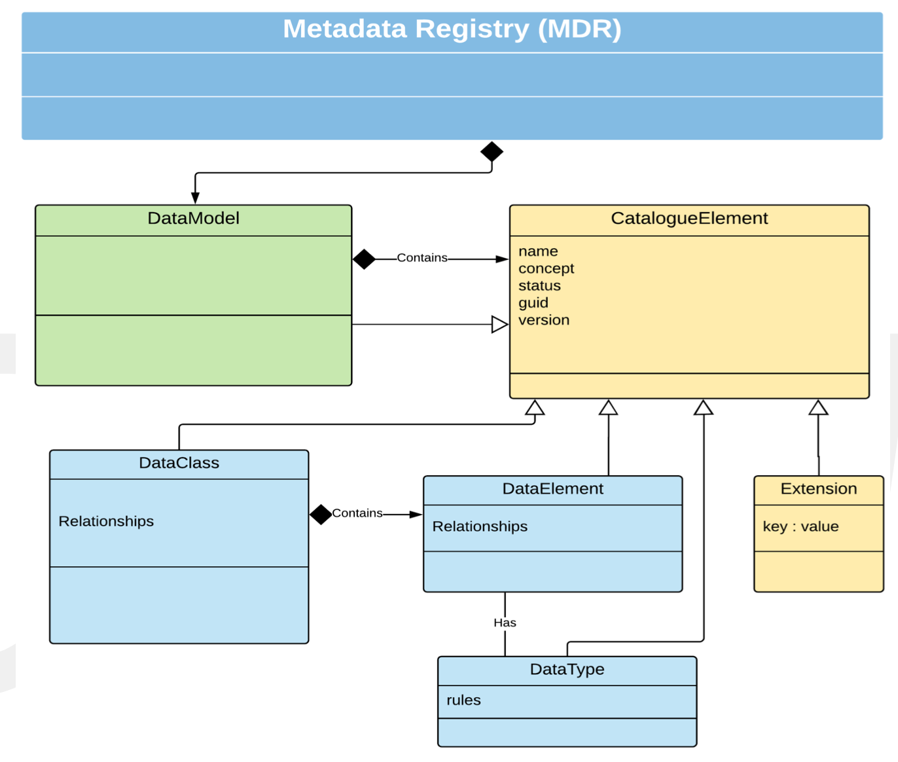
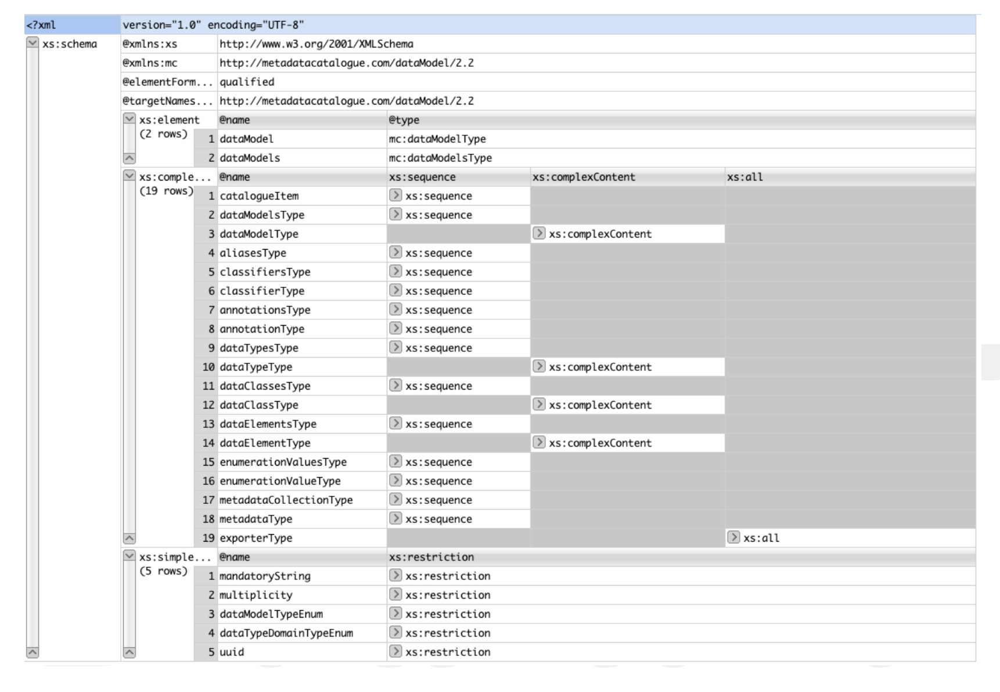
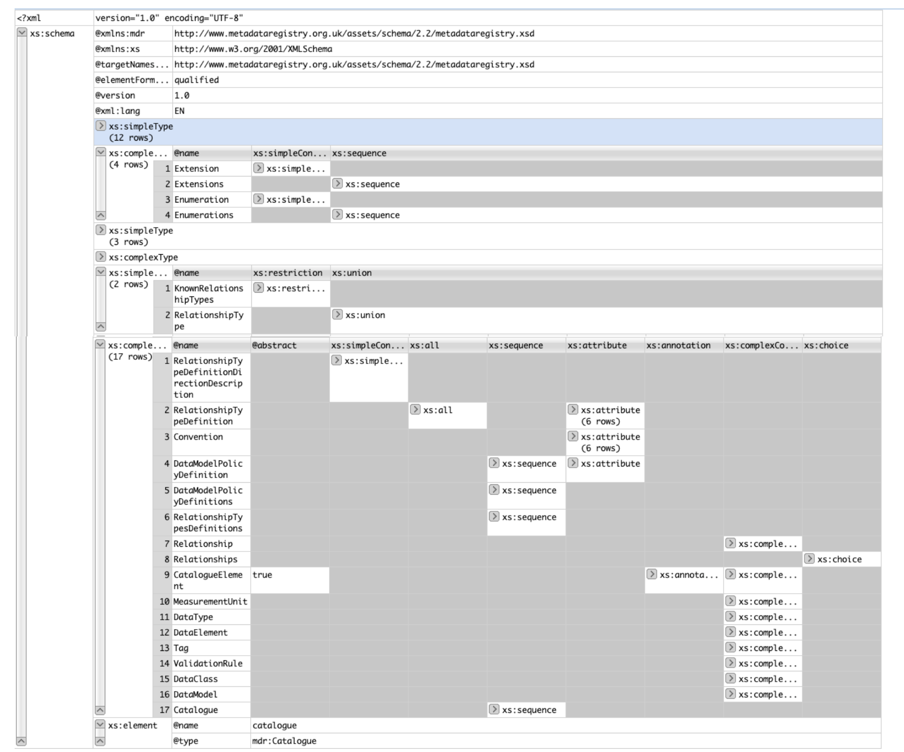

 

**Document type:       Proposal**

**Title:                           Healthcare Metadata Federation
Specification**

**Status:                       DRAFT**

**Date of document:   2020-06-08**

**Source:                      David Milward**

1       Contents
================

Table of Contents

[1    Scope.](HDRFederation1.md)

[2    Versioning and publishing. ](HDRFederation2.md)

[3    Normative References. ](HDRFederation3.md)

[4    Terms and Definitions. ](HDRFederation4.md)

[5    Proposal Background. ](HDRFederation5.md)

[6    Metamodel Specification. ](HDRFederation6.md)

[7    Minimum Viable Product API ](HDRFederation7.md)

[8    Summary. ](HDRFederation8.md)

[9    Appendix 1. Formal Specification.](HDRFederation9.md)

[10   Appendix 2  Proposed Grammar. ](HDRFederation10.md)

 

2       Scope
=============

This specification is intended to serve as a specification for enabling multiple 
metadata registries to carry out federated operations such as search on
datasets held by Health Data Research UK (HDRUK) members and Hubs.
It is intended that the specification be developed and extended, in time, to
serve UK National Health Service and Healthcare organisations globally.

Much of the work has been based on the idea of building a technical metadata
meta-model in order to automate much of the mapping, curation and relationship
work which is carried out manually on datasets. This is needed in order to integrate data in a
machine-friendly fashion.  The work builds on work expressed in ISO11179, which
is a 6-part standard specifying how to design and build a metadata registry, but uses a new meta-model
which enables automation of metadata management, an essential part of integrating dataset.

Enabling automated data-matching by using metadata will not achieve semantic
interoperability on its own, however it will help to achieve data integration in
less time, and with less expert effort that is now commonplace. It can thus be
viewed as step towards the goal of semantic interoperability. The work carried
out to develop this metamodel is covered papers referenced in (8) and (9).

The purposes of the ISO 11179 standard are to promote the following:

*    Standard description of data

*    Common understanding of data across organizational elements and between organizations

*    Re-use and standardization of data over time, space, and applications

*    Harmonization and standardization of data within an organization and across organizations

*    Management of the components of data

*    Re-use of the components of data

2.1       Key Decisions
-----------------------

This document is intended to be an initial discussion document. The principles
of the specification need to be defined in general terms, before we can move to
implementation details and specification of technologies. Currently once we have
agreed basic principles, in particular those related to versioning we can then
move to security principles and an MVP implementation.

 

Key theoretical stages:

To build a federation we need to agree on identifiers and versioning as the core
of the registry system.

1.     Unique Identifiers

We need to agree how to uniquely identify datasets within the registry.  This is
linked to the idea of versioning and publishing, and currently a system based on
the ideas within ISO11179 is suggested as a way forward. This means that every
item in the catalogue will be given a unique identifier.  All items will be
grouped into Data Models (effectively a template for a dataset), and this will
be given a unique identifier based around the current internet domain name
system – an IRI. The suggested form is:

**\<domain name\>\<data model unique identifier – version\>**

For example we may have a reference dataset called “Pathology Codes” this can be
given the IRI:

<https://www.hdruk.ac.uk/>198992/

Data elements within a data model can also use this IRI format, so that another
element within the Data Model will be accessed using an extension of this
scheme, so for a data element “Aldosterone” within a reference Data Model we may
use the IRI as follows:

<https://www.hdruk.ac.uk/188998/dataElement/189056>

or even:

“<https://www.hdruk.ac.uk/188998/189056>”

 

 

 

Having an IRI means that registries in the federation can look up the “Cancer”
dataset in registry A without confusing it with the “Cancer” dataset in registry
B.

 

*As a user of registry A, I will be able to look up all datasets registered in
the whole federation using an IRI, and can be confident that
“https://RegistryA/CancerDataset“ is not going to be confused with
“https://RegistryB.com/CancerDataset”.*

*As a user if I want to use a data standard, which is simply identified by a
name, and whose version keeps changing, then I need to keep a copy of that whole
data standard locally, and have the ability to update my local copy, so that I
am not out of sync with this data standard.  Otherwise the dataset I build
referencing the standard today may be out of step tomorrow as the standard has
been updated.*

*As a user I may need to import a copy of Data Model (or standard) into my
registry, in order to build a new (conformant) data model, I need to keep the
trace of where the Data Model originated in order to maintain the provenance of
my dataset.*

*As a researcher in organisation A, with registry A as my local registry. I want
to build a set of forms to capture data based on a standard published by
registry B (because they have done some up to date work on say influenza vaccine
side effects) and I have located a Data Model (X version 1.0.0) in registry B,
which has all the specifications I need for my research forms. I will import
that into my registry, so that the Data Model(*<https://registryB/X-1.0.0>*)
will now be given a new local identifier of* <https://registryA/X-1.0.0/I-01>
*where the last part of the identifier identifies it as an imported model, with
an arbitrary letter ‘l’ for local and a unique number of the import – this
enables details of the import, including the original IRI, to be kept.  This can
be thought of as akin to a library storing their copy of the “Encyclopaedia
Brittanica” with a local index which will help the librarian find the book when
it is asked for.*

Having an IRI means that a resource is unique everywhere, and if I need to
impose security constraints on that particular dataset or Data Model I can do so
easily, by relating that IRI to a user or group identifier.

*As a data owner I want to ensure that the consent details surrounding a
particular dataset are adhered to.  I want to control who can see the details
relating to which datasets I am willing to share, and what are the conditions
that I intend to impose on these datasets.  I may want to store datasets that
are private to my organisation, but I may want to share some of these datasets
with other organizations.*

 

2.2.     Versioning and publishing
===
 

A registry will contain Data Models that will be in different stages of
development, currently we envisage:

 

1.     Draft – Data Models are being built and changed, the contents are not
fixed and therefore the data model cannot be used by another (federated)
registry.

2.     Live – A Data Model will be fixed in terms of its technical structure and
metadata

3.     Published – A Data Model can be published to other organisations within
the federation, and some aspects of the metadata are made available and
searchable for all.

4.     Superceded – A Data Model can be replaced as the current “Live” or
“Published” version, however it is still accessible and available within the
registry. Users are aware by its status that there is a newer version available.

5.     Deprecated – A Data Model is no longer used and maybe deleted in the near
future.

 

*As a researcher I need to collaborate with other researchers in my organisation
to build a new research dataset, and therefore we both need access to a “draft”
Data Model which we can alter and update until we are happy with it.*

 

*As a researcher I need to make my Data Model available and publish it locally,
at this point it is given a new unique identifier, such as \<domain name\>\<data
model identifier – version 1.0.0\>, see the first pass of the version diagram –
Figure X.*

 

*As a researcher I need to update an existing Live Data Model. In this case I
would create a new version, as a draft, which would then become \<domain
name\>\<data model identifier – version 1.0.0\> of the data model (see Figure X
below), and it would replace version 1.0.0 as the current “live” version, itself
being now marked as “superceded”.*

 

 

3       Proposal Background
===========================

3.1      Background
-------------------

Health Data Research UK (HDR UK) has launched the Minimum Viable Product (MVP)
solution for the Innovation Gateway that allows for a rich set of level
information that describes the datasets that are available for research and
innovation across members of the UK Health Data Research Alliance and the seven
health data research hubs. This information is stored in the form of Metadata in
a central repository, which can be used directly by these organisations.
Additionally, there is also an easy to use Metadata Onboarding Portal for
non-technical users to provide their metadata, which is stored in the Onboarding
Metadata Repository.

This arrangement as well as plans by more technically advanced hubs and alliance
members to create and operate their own metadata repositories means that HDR UK
has identified a need for a federated mechanism for maintaining, storing and
accessing metadata. This mechanism must be fully automated beyond the initial
setup of the gateway membership to allow the Gateway and members of the
federation to index the information to return any search results from any of the
members without having to explicitly find the member that the information
originates from.

HDR UK’s initial requirements have been used as a baseline specification and
iterated based on feedback and suggestions from NHS Digital and Oxford
University (providing the Metadata catalogue) HDR UK, its alliance members and
the hubs.

The following principles have governed the work and decisions made:

·      Specification that will be distributed in first iteration will be “good
enough MVP” rather than perfect

·      Metadata Federation should use open standards whenever possible and only
if no standard can be found should we create a new mechanism.

The specification is split into the following sections:

·      Summary Metadata, giving overview and search terms for indexing purposes.

·      Descriptive Metadata i.e. metadata required to manage data catalogues and
is descriptive in content.

·      Technical Metadata, i.e. a formal (or mathematical) metamodel of data
structure and other technical aspects of the data.

·      Operational Metadata, including quality, profile, volume, lineage and
other aspects of the data relating to processing of underlying data to the
resulting data present in the dataset.

·      A peer-to-peer Metadata Federation that covers

o   Data catalogues that can be published and linked to specifications for its
data elements

o   Universally Unique identifiers for every item in all data catalogues in the
federation (and beyond???)

o   Structured metadata for items in the catalogue

o   Linking data terms to each other within the original catalogue as well as
others elsewhere in the federation network

o   Data Dictionary that defines enterprise data (not “Standards”) in which a
name, definition, datatype and enumeration if present, need to be made available
in machine readable and human readable format for Data sharing, semi-automated
customization of data collection tools and other uses

o   Machine readable format for metadata specifications to support data mapping
and transformation

o   Replicated data set address indexes across the federation network

o   Persistent Access control across the federation network

o   Federation API endpoints and descriptions

 

 

 

4       Requirements
====================

4.1       Primary Requirements
------------------------------

We expect that the key requirement for a researcher will be to find out all
possible information about a subject X.  How this information is stored and what
is needed to do to be able to access that data is the job that a metadata
federation should do. From this basis we look at how this can be split into
detailed requirements, some of which we express as user stories.

### 4.1.1      As a researcher I want to understand all the data available on subject of interest.

Data is held in datasets. Datasets can be excel files, csv files, RDF files, XML
Files, RDMS or even text files. So all of the data in these heterogeneous
formats need to be converted to the same format in order to work with it, so the
way in which the data is stored needs to be recorded.

 

Data in one dataset can be linked to data in another dataset. For example, very
often datasets are built to conform with a version of a reference data standard
such as SNOMED CT, FHIR or LOINC for example. This means that if a data element
in dataset A is described using SNOMED CT code XY, it can be linked to every
other data element which is described using the same code XY.  This kind of
linking will allow a researcher to expand the datasets that are of interest, or
even the set of data elements of interest, despite the fact that they reside in
many different data repositories.

 

Linking on an open data can enable vast amounts of data stored in multiple
repositories to be linked, enabling the researcher to navigate the data directly
and build up a knowledge graph of all the data they need.  This works when all
the data is either stored in RDF/OWL, or served up as JSON-LD or RDF,  and where
minimal security is attached to the data.  Whilst many of the ideas behind
linked open data can be used in building a federated metadata registry system,
the fact that not all local repositories and registries are able, or willing, to
publish data in an open-data format must be accounted for. The federated system
needs to function for heterogeneous datasets, i.e. those stored as excel, csv,
in XML files, in various relational and NOSQL databases, RDF, graph databases,
where the formatting and structuring is specified in multiple different ways.

 

 

### 4.1.2      As a researcher I want to know where relevant data resides so that I can find out how to access it.

This comes from the previous requirement and states that as a researcher my goal
is to access as many datasets that have data related to my subject X as
possible.  If I run a search on one part of the network, I want to be able to
find all the datasets that reside in both my local organization or network
section but also which reside in other network sections or organisations located
elsewhere.

 

### 4.1.3      As a researcher once I understand where a dataset is located, I want to satisfy all the requirements to download it and use it in my research.

Once I have enough metadata to determine that a dataset is of interest to me, I
need to find out who to contact to obtain that dataset (or subset thereof). I
need to know what the constraints on that dataset are, whether I can take a copy
of the data to keep locally, or if I can get updates of the dataset should it be
updated. I need to know how good the data is, and how the data is structured. 

 

### 4.1.4      As a researcher I want to be able to map my analysis dataset to the source datasets that are available.

This is a key requirement, the data may reside in many different datasets
described by different schema types, and so some kind of estimation of how to
source the data needs to be carried out. Data may already be passed from one
system to another using ETL techniques, and some of this data may already have
been assessed and moved using transformations.

 

As an example, suppose I need the following very simple table of data:

| Date of Consultation  | Diagnosis |
| --- | --- |
| `Date` | Data Conforming to SNOMED CT |
| `Date` | Data Conforming to SNOMED CT |

And I suspect I may need data from Cancer Registry A, and Cancer Registry B, the
schemas are given for Cancer Registry A in an XSD document, and for Cancer
Registry B in a relational database schema. These are shown in Figure A and B
below.
 

**Figure A: Cancer Registry Model A**

 

 

**Figure B: Cancer Registry Model B**

 

There are problems here with naming, structure and versioning which conspire to
make it difficult to just take a file of data conforming to Cancer Model A and
add it to data conforming to Cancer Model B.

 

 

 

 

4.2       Secondary Requirements
--------------------------------

The key requirements are to be able to search a group of federated metadata
registries as if they were a single store of datasets. The first issue is how to
identify different datasets.

### 4.2.1      Naming and Versioning

Globally unique identifiers will enable different datasets and even component
data elements to be identified. A system which allows an organisation’s name, or
the name of a particular metadata registry to be included in the naming system
will help location.

 

As a researcher I may obtain access to several datasets, A, B, and C for a
particular research subject, these may be located in different places, so if we
assume that each organisation has it’s own name as part of the naming system, we
can uniquely identify each dataset with the following unique identity:

 

**\<Organisation\>\<DatasetID\>**

 

This assumes that each organisation has a unique name or identifier such as a
domain name as given by the global internet domain name system. If that is the
case then assuming all the datasets for an organisation are registered in one
metadata registry, with all the appropriate metadata, then as a researcher I
will be able to guarantee that my datasets A, B and C can always be correctly
identified.

 

In addition if my metadata registry is able to uniquely identify data elements
and other artefacts, I will be able to append an artefact identifier, to build
up a hierarchical naming system for all the technical metadata as follows:

 

**https://\<Organisation-domain-name\>/\<DatasetID\>/\<DataArtefactID\>.**

 

 

 

### 4.2.2      Versioning

The NHS data dictionary has a website and a download area for its key datasets,
and people can use the website to look up data formats, and ensure that the
codes they are using for a clinical trial record align, for reporting purposes,
with the current datasets on the website.  However, there have been at least 15
updates to the NHS Data dictionary.

 

#### 4.2.2.1      **As a researcher if I record that I am using a data element from the NHS data dictionary today, and reference that same URL and named element in 12 months there is a chance that it will have changed.** If this happens then the data I am collecting will no longer align with the reporting system, and I may have to manually convert the data.

 

To avoid this problem the version needs to be part of the name, and we need to
ensure that the contents of the dataset once given a version doesn’t change.

 

### 4.2.3      Linking

As a researcher I may need to link to another dataset, or dataset specification
without downloading the whole content of the specification. As with the previous
example, I may build my own dataset, but I want some key elements in common with
common dataset specifications such as SNOMED CT or LOINC.

 

A mechanism to link a data element, a group of data elements or even a whole
dataset to the newly curated dataset will allow that information to be brought
into the new dataset. We may define different types of linking relationships, so
that in some case data elements I use locally can be forced to align with a
particular dataset standard.

 

This indicates that we need the means to define the link itself, and possibly
add some information about how the link will be used, in other words define a
relationship with the other dataset or group of elements.

 

### 4.2.4      Import Mechanism

As a researcher I may need to import all the data in a dataset into my own
research environment in order to work on it and make it available to co-workers
in my team. In this case it makes sense to be able to copy the original dataset,
together with the meta-dataset, and install it locally, whilst registering it
with the metadata registry. That way other people with access to my local
metadata registry can also see that it is available, and see under what
conditions I am making it available locally.

 

#### **4.2.4.1      As a researcher I want to import the source metadata into my local metadata registry**

This is important for the reasons identified in 4.1.4, but also it is useful to
have a record of where data is stored, and to have it locally without needing to
make global searches. It makes sense to be able to import the data directly to a
local metadata instance.

*For example if I am building a new dataset specification Y, and I am taking
some definitions X (from another organisation), I will also want to see where
these definitions originate: are they part of a reference dataset (SNOMED CT for
instance) which is residing in registry D? or did they originate somewhere else
– reference R for instance. I may want to import some other definitions X2 from
registry D instead, or go to registry R for the original definitions.*

 

#### **4.2.4.2      As a researcher I want to import the source data into my local data repository.**

As a researcher, having made a request for a dataset, ideally I would expect to
receive a copy of that dataset which I can then store locally in my working data
repository. It may be possible for the source data repository guardian to simply
provide the appropriate security credentials, which when received can be used to
access the data directly for a specific time period.

 

### 4.2.5      As a Data Publisher I want many experts from many organisations to contribute to my new data model, in order to get it widely endorsed and used.

As a data publisher I want to put a model together which covers my expertise,
but I also want other experts to contribute so that other areas that I am not so
strong in can be well defined. This means that if I put together a model of a
dataset, name, version and publish it then other people in other organisations
should be able to modify it.

For this to happen the original version needs to be fixed in structure, and each
separate modification needs to be versioned in a new “copy”, or “draft” version
of the dataset specification. Lets suppose there is a model A in registry Z, I
take a copy (A1) and modify it. I then send it back to registry Z as model A1.
Registry Z needs to be able to access model A and create a new model based on
the incoming model A1. Now someone else may have started working on a new
version of model A in registry Z, therefore I need a naming system which will be
able to:

1)    Relate the incoming draft model A1 to the original fixed model A.

2)    Differentiate the incoming model A1 from the other model A1 already in
registry Z.

 

 

 

 

 

 

4.3      
---------

 

In summary we can view the requirements as being:

1.     Search to see what datasets are available for research

2.     Search to obtain details and access to datasets of interest

3.     Search to see alignment of data elements used in different datasets.

4.     Build new datasets re-using good common definitions.

5.     Build fused datasets where datasets are compatible and linkable.

6.     Relate datasets to core dataset specifications (e.g. SNOMED CT) and to
standard references datasets (e.g. NHS Data Dictionary).

 

 

 

 

 

5       Basic Principles
========================

 

This section looks at how the requirements in the previous section can be
implemented in practise, and explores some of the issues in a bit more depth.

5.1       Unique Identifiers and Version Control
------------------------------------------------

 

 

5.2       Descriptive Metadata
------------------------------

 

 

5.3       Technical Metadata
----------------------------

 

 

5.4       Security (Concerns)
-----------------------------

It is anticipated that organizations will each have their own metadata registry,
and that the security will be managed on a peer-to-peer basis. In essence,
datasets are resources, and metadata about resources is also a resource which is
owned, and therefore needs to be managed.

To meet the requirements of federated access to these resources

·      Each metadata registry would manage its own users, and each registry
would trust users from all the other metadata registries.

·      A user in one registry would be able to read objects in a remote registry
but would be unable to update them, unless specifically permitted.

We suggest 2 authorisation mechanisms, the first is a more simplistic role-base
mechanism, the second is a fully fledged authorization system which can be as
fine-grained as the metadata registry owner wishes. This is augmented by the
ability to enable Federated Single Sign on across the registry network.

### 5.4.1      Authentication

Authentication can be done locally in a metadata registry, using simple username
and passwords.

Alternatively, a web-based scheme such as OpenID can be used, or indeed
Google/Microsoft/Facebook authentication application.

What kind of authentication is required?

### 5.4.2      Authorization

Authorization can be carried out using a web-based method, or using an
enterprise scheme, or it can be implemented locally on each metadata registry.
The main alternatives are Role-based access control, and Access Control List
authorization, the latter allowing a more fine-grained approach.

What kind of authorisation is required?

#### 5.4.2.1       Role-based access control security model

Under this model the federation will collectively define a set of roles, say
Administrator, Data-user, Data-reader, and assigned permissions to these roles
as follows:

**Role**

**Users**

**Local Objects**

**Remote Objects**

Administrator

Can add/update/delete local users

Can read/add/update/delete objects

No rights

Data-user

\-

Can read/add/update/delete objects

Can read objects

Data-reader

\-

Can read objects

Can read objects

The key concept here is that users would have very broad control allotted to
them, based on their assigned role for all objects stored in the metadata
registry. This would include all 4 different metadata categories. There would be
no capability to alter access based on the user and/or the object in question.

#### 5.4.2.2       Access Control List security model

This model gives the owner of each object in a metadata registry the ability to
control who can access each metadata object, this could be taken right down to
data elements in a dataset, however the more fine-grained the security the
greater the administrative burden for the data owner.

It is likely that some degree of role-based permissions would be needed for
implementing the basic search capability, so that a user in MDR A can make a
search and get results from MDR B,C and D.

However the amount of access that a user can obtain maybe constrained by their
rights to the datasets, and although they may be able to view the summary
metadata of all the data models being stored in the federation, they may have to
ask the data-owner for permission to get the business, technical and operational
metadata associated with that dataset.

#### 5.4.2.3      Federated Single Sign-On

The authorisation schemes above govern access to resources within a registry.

Let’s assume a Data-reader in MDR A makes a search for “cancer”, and a list of
datasets are returned from MDR A,B & C. For coarse grained security the list
will only list the URI of the dataset and on clicking that URL the user will be
taken to the web page associated with that catalogue item. However, they may not
have permission to access the dataset, in which case they will be re-directed to
make an (email) request to gain permissions to access the resources concerned.
For finer grained security at individual attribute or metadata item level, each
such resources would need to be addressable using URLs  in their own right and
accessing those would follow the same pattern.

This scenario assumes a federated authentication and authorization system, such
as SAML (<http://docs.oasis-open.org/security/saml/v2.0/>) or OpenID Connect
Federation (<https://openid.net/specs/openid-connect-federation-1_0.html> ) in
play. Each registry will be responsible for its users, and if a user wants to
gain full access to local resources, they will need to obtain a local account
with appropriate permission.

Both SAML and OpenID Connect Federation work based on assertions provided by the
owning authority of a resource including any required access rights or other
properties. OpenID Federation in particular builds on top of OpenID connect
authentication mechanism to enable a user authenticated y one member of the
federation to be reused dynamically to access resources of another member.

SAML is XML based and has advanced capabilities for federation, so it is
suitable for server to server communications, but browser based SAML exchanges
can become quite onerous because of large XML  request and response payloads.

OpenID Connect avoids some of these issues by using JSON as its payloads format
and provides a nice thin layer of authentication over OAuth 2 to satisfy the
core authentication and authorisation needs of modern-day web and API access.

The big identity providers like Google and Facebook etc., use this very
combination for authentication and authorisation.

The final piece of picture to fulfil the requirements of this specification is
provided by OpenID Connect Federation which provides mechanism for single sign
on across a federation as well as account linking i.e. ability to have multiple
local accounts in the federation and use them as appropriate in a single trust
chain or multiple overlapping ones

Google, Facebook etc. have some support for the Single Sign On aspects of OpenID
Connect Federation but the account linking is mostly proprietary still.

**Recommendation:  Use OpenID Connect for authentication OAuth2 for core
authorisation and OpenID Connect Federation, which are all open standards and
will allow for both coarse and  fine-grained access control.**

5.5       Current Metadata Requirements
---------------------------------------

The current version of the HDR metadata specification requires that an
organization provides the following metadata fields:

·      Name

·      Logo

·      About

·      Membership

·      Grid.ac identifier

·      Contact Point

·      Access Rights

·      Access Request Cost

·      Access Request Duration

·      Access Environment

·      Terms and Conditions

These would be automatically appended to all datasets being catalogued, and thus
would be searchable throughout the federation.

The specification lists the following items as summary metadata:

·      DOI

·      Title

·      Abstract

·      Publisher

·      Contact Point

·      Group

·      Local Identifier

The metadata items classed as ‘organisational’ and ‘summary’ are those which
will be visible by anyone who has access to the federated metadata registry
system. The search should go ahead using keywords, which are protected as
‘business’ metadata, however all these items above will be visible on a search
result.

6       Metamodel Specification
===============================

This section is informative at present, much depends on answers given in the
previous sections.

A metamodel is required for management of the technical metadata. Meta-models in
the database world are called  *schemas* and if all the datasets were based on
SQL data structures then it would be possible to call this section the
*schema*.  However, in order to differentiate relational-database-schemas, XML
Schemas, UML models and other structures we are using the term *Metamodel* to
denote the structure of a dataset.

Currently 2 metamodels are being used in the registries used by HDR, one for the
onboarding (Metadataworks or MDW), and one as the core metadata registry
(Oxford). These models are very close and are derived from the ISO11179
metamodel during research carried out for the most part at Oxford University.
Both models are designed to capture the structure of the data efficiently and
provide a means of managing the publication and versioning of datasets, however
they are totally focused on technical metadata. Both models can handle
extensible metadata, meaning that whatever summary, business and operational
metadata is chosen it can be managed. However, because of the way it is stored,
as unstructured key-value pairs, it is not necessarily the most efficient way of
handling the summary, business and operational metadata.

It is conceivable that we can extend the metamodel to allow for any kind of
structured metadata, but using the technical metamodel to manage the summary,
business and operational metadata.  The drawback of this is that the metadata
registry would need to be re-engineered, perhaps using RDF or RDFa as the core
technical binding instead of XML/UML as it currently is. The advantage would be
a much more flexible structure metadata registry in the long term.

6.1      The Current ISO11179 Metamodel
---------------------------------------
 

Figure 1 - Consolidated metamodel from ISO11179-3

6.2      ISO11179 Artefact Details
----------------------------------

The standard defines a number of terms which used to build up the description of
the core metamodel in Part 3, and these will be examined in the light of how one
can build a model using the standard from an existing database. By taking some
of the key terms and redefining them using a formal and a semi-formal system we
can arrive at a set of definitions which can define a metamodel sufficient to
capture context from any existing database or data-store.

The central artefact in the model is that of *Data Element*, defined in the
standard as shown in Table 1. The definition states that it is the result of
assigning a Data Element Concept to a Value Domain, and thus it is arguably a
relation between a Data Element Concept and a Value Domain.

*Data Type* - A Datatype is designated by a data type name and described by a
datatype description. The datatype name is usually drawn from some external
source, which is designated by a datatype scheme reference. Additional
information may optionally be provided using the datatype annotation

*Value Domain* - An example of a Conceptual Domain and a set of Value Domains is
ISO 3166, Codes for the representation of names of countries. For instance, ISO
3166 describes the set of seven Value Do- mains: short name in English, official
name in English, short name in French, official name in French, alpha-2 code,
alpha-3 code, and numeric code.

The idea of a Value Domain is not in widespread usage in data management or
computer science texts, in fact it doesn’t appear in a Wikipedia search other
than in the context of ISO11179. Thus, standard representations of ISO 3166 in
database tables do not include any reference to Value Domains, and it would
therefore entirely feasible to represent the context in which an aspect of
ISO3166 is used, say 2-character country codes, without any need to identify the
Value Domain concerned.

Data Types are associated with Value Domains, and a definition is provided in
Table 2, however it may be relevant at this stage to look at the general usage
of the term as well some other definitions. Parnas (Parnas et al., 1976)
identified 5 different ways in which the word *Data Type* is defined:

·      Syntactic.

·      Value Space. A type is defined by a set of possible values. 

·      Behaviour.   A type is defined by a value space and a set of operations
on elements of that space

·      Representation and Behaviour. A type is defined as its representation and
a set of operators manipulating that representation

·      Value Space and Behaviour. A type is a set of values which a variable can
possess, and a set of functions applied to those values.

Data Types are used in programming languages for the most part to detect errors,
by having a statically and strongly typed language errors can be detected by the
compiler before the program is run. Cardelli and Wegner (Cardelli and Wegner,
1985) provide the following explanation:

A type system has as its major purpose to avoid embarrassing questions about
representations, and to forbid situations where these questions might come up. 
In mathematics as in programming, types impose constraints which help to enforce
correctness. Some untyped universes, like naive set theory, were found to be
logically inconsistent, and typed versions were proposed to eliminate
inconsistencies. Typed versions of set theory, just like typed programming
languages, impose constraints on object interaction which prevent objects (in
this case sets) from inconsistent interaction with other objects. A type may be
viewed as a set of clothes (or a suit of armour) that protects an underlying
untyped representation from arbitrary or unintended use. It provides a
protective covering that hides the underlying representation and constrains the
way objects may interact with other objects. In an untyped system untyped
objects are naked in that the underlying representation is exposed for all to
see. Violating the type system involves removing the protective set of clothing
and operating directly on the naked representation.

Generally both programming languages and databases will have fixed datatypes,
and there is a widespread degree of overlap between the data types used by the
many languages and databases in service, Appendix 3 details the many data types
in common use in C, C++, Java, Python, MySQL, SQL Server and MS Access. From
this we can build up a set of artefacts which can model all these datatypes from
within a metadata registry, and by defining a direct mapping we can build this
part of the metadata model automatically.

Table 1 - Metamodel Domain Constructs 1

**ISO 11179 Structural Artefacts**

**Definition**

Conceptual Domain

a set of valid Value Meanings expressed as a description or via a set of
enumerations

Object Class

a set of ideas, abstractions, or things in the real world that are identified
with explicit boundaries and meaning and whose properties and behaviour follow
the same rules

Property

a characteristic common to all members of an Object Class

Data Element Concept

A Data Element Concept is a concept that can be represented in the form of a
data element, described independently of any particular representation. A Data
Element Concept may have zero or one Object Class and zero or one Property. The
union of a Property and an Object Class provides significance beyond either that
of the Property or the Object Class. A Data Element Concept thus has a
Definition independent from the Definition of the Object Class or the Property.

Data Element

A Data Element is considered to be a basic unit of data of interest to an
organization. It is a unit of data for which the definition, identification,
representation, and permissible values are specified by means of a set of
attributes. A Data Element is formed when a Data Element Concept is assigned a
representation. One of the key components of a representation is the Value
Domain, i.e., restricted valid values.

DataType

A Value Domain is associated with a Datatype a set of distinct values,
characterized by properties of those values and by operations on those values,
for example the category used for the collection of letters, digits, and/or
symbols to depict values of a Data Element determined by the operations that may
be performed on the Data Element.

Value Domain

(3.3.140) a set of Permissible Values. One of the key components of a
representation is the Value Domain. A Value Domain is associated with a
Conceptual Domain. A Value Domain provides a representation for the Conceptual
Domain.

Described or Non-enumerated Value Domain

A Value Domain may be expressed via a description or specification, such as a
rule, a procedure, or a range (i.e., interval), rather than as an explicit set
of Permissible Values. Such a Value Domain is called a Non-enumerated Value
Domain. As a sub-type of Value Domain, a Non-enumerated Value Domain inherits
the attributes and relationships of the former.

Enumerated Value Domain

An Enumerated Value Domain is one where the Value Domain is expressed as an
explicit set of two or more Permissible Values. As a sub-type of Value Domain,
an Enumerated Value Domain inherits the attributes and relationships of the
former

Permissible Value

A Permissible Value is an expression of a Value Meaning within an Enumerated
Value Domain. It is one of a set of such values that comprises an Enumerated
Value Domain. Each Permissible Value is associated with a Value Meaning.

Enumerated Conceptual Domain

a Conceptual Domain that is specified by a list of all its Value Meanings

 

Table 2 - Metamodel Domain Constructs 2

**ISO 11179 Relational Artefacts**

**Definition**

Relation

A Relation is a class each instance of which models a relation (3.2.119), a
sense in which concepts (3.2.18) may be connected via constituent relation roles
(

Relationship

(metamodel) a connection among model elements

Generalization

relationship (3.1.15) between a more general class (the parent) and a more
specific class (the child) that is fully consistent with the general class and
that adds additional information. A generalization is a type of relationship
(3.1.15); (Adapted from ISO/IEC 19505-2:2012, 7.3.20.)

Classification

A metadata item is classified if it has one or more Classification (9.2.3.1)
association classes, each with a Concept (9.1.2.1) class in a Concept System
(9.1.2.2).

classification scheme

descriptive information for an arrangement or division of objects (3.2.87) into
groups based on criteria such as characteristics (3.2.14), which the objects
have in com- mon

classifiable item

metadata item (3.2.75) of a type for which classification is supported in a
given metadata registry (3.2.78)

Concept System

Concept Systems may be used as classification schemes to classify Classifiable
Items within a registry, but some classification schemes will be more applicable
to classifying objects in the real world than items in a registry. If the
objects to be classified are not in the registry, the classification scheme may
still be recorded using the Concept System structures. A classification scheme
may be a taxonomy, a network, an ontology, or any other terminological system.
The classification may also be just a list of controlled vocabulary of property
words (or terms). The list might be taken from the ”leaf level” of a taxonomy.
Examples include SKOS, UML, OWL.

Concept

(3.2.18 )unit of knowledge created by a unique combination of characteristics

Unit of measure

value domain actual units in which the associated values are measured

Dimensionality

set of equivalent units of measure

6.3      Revised Metamodel Overview
-----------------------------------

tbd

6.4      FMDR Metamodel
-----------------------

The goal of the FMD registry is to build a metamodel of a dataset based on
access to a database table, series of tables or spreadsheet.

The language defines data elements, ways to group data elements, and ways to
handle relationships between different elements, within the same domain or
collection, and with data elements in other collections. It also is able to
define rules for typing and thus verifying data items, and also to define rules
or constraints, which in turn operate on groups of data elements. By defining
groups of data elements as data classes, a basic data structure, corresponding
to the structure used in almost all object-oriented computer languages and
databases storage mechanism can be built up.

Groups of classes are termed models, a model corresponding to a dataset, or as
in the case of health constraint information within one group, that information
then has the possibility to be transferred with the data during data transfer
operations, or due to the reference mechanisms in place to be referred to at a
later point in time.

 

Figure 2; FMDR Core Metamodel (subject to change)

The key artefacts of the new metamodel are:

Data Model

This artefact captures an overall group of data items which belong together, it
can be thought similar to a conceptual domain which groups a number of concepts
around a set of core idea. A terminology or dataset could be grouped as a Data
Model, and then versioning and publication is for simplicity grouped together.
For instance, one may wish to collect all the data elements pertaining to a
particular type of disease or illness, and curate them as a single Data Model.
One also may wish to import all the Data Elements from a particular system which
handles a particular disease or clinical grouping such as “haematology”, or
“lung cancer”

Data Class

This is a way of grouping or classifying collections of different data elements,
some of the containment relationships are borrowed from Object modelling
languages to handle hierarchical inheritance. However, inheritance here can be
configured for multiple or single inheritance as a policy. This can then be
adjusted using the import mechanisms to handle table linking as appropriate.

Data Element

This is the core element, and in many ways is similar to the current Data
Element, essentially this is an atomic data unit, which is related to a single
concept or idea, captured either by way of a link or in the name and description
of the Data Element.

Data Type

Every Data Element will have a single Data Type – which may be descriptive,
primitive (value based as given by the data source) or reference.

Relationship

These can be configured as appropriate and allow different Data Elements to be
linked together.

ExtensionItem (MetadataItem)

The Metadata Item can be added to any other Registered Element as appropriate
and will consist of a key-value pair.

RegisteredItem  (CatalogueElement)

The basis of all other registry element (i.e. Data Models, Data Classes, Data
Elements, ExtensionItems and Data Types are all RegistryItems, with a unique IRI
and a version.

 

6.5      FMDR Grammar
---------------------

To be defined

6.6       Metamodel Comparison
------------------------------

The following comparison is made by comparing the core Metadata Works codebase
with the model described on the Oxford Metadata Catalogue Wiki site, however it
must be pointed out that without sight of the source code it is possible that
the Oxford Data Catalogue has not been fully documented here.

Any amendments from the Oxford team would be most welcome.

Table 3: Metamodel Comparison

Notes

MDW

Oxford

ISO11179

Some properties differ

DataModel(Physical & Logical)

DataModel

\-

 

DataClass

DataClass

Object Class

 

Term

Term

Concept

 

DataElement

DataElement (Attribute?)

Data Element

 

DataType

DataType

Data Type

 

EnumeratedType

EnumerationValue

Enumerated Value Domain

 

PrimitiveType

\-

\-

 

ReferenceType

\-

\-

 

Relationship

\-

Relation

 

RelationshipType

\-

\-

 

RelationshipMetadata

\-

\-

 

ExtensionValue(MetadataItem)

Metadata

\-

 

Tag

Classifier

Classification

 

ValidationRule

\-

 

 

Asset

Attachment

 

 

AssetFile

 

 

 

\-

Comment

 

 

DataModel(Conceptual)

Terminology

 

 

Relationship (in Conceptual DataModel)

Term Relationship

 

 

Measurement Unit

 

Measurement Unit

 

7       Minimum Viable Product (MVP) : Implementation 
======================================================

**Recommendation: We develop a simple example of a federated system using
current available metadata registries, and from there look at a more
implementation-independent specification.**

Much of the work here depends decisions made in the previous sections, so please
treat this is a starting point for discussion.

Both the MDW and Oxford MDR’s are built using XML transfer mechanism, so for any
test instance we will probably need to remain in the XML technical space. Both
metadata registries have basic API’s that can be used to test out the Federation
principles.

Essential features of any implementation are firstly to have a single URL for
each data-model(dataset), and ideally to include in that URL the status and
version of the data-model. Attached to this can be the key metadata payload,
which could then be used to de-reference the “full” data-model from its (home)
metadata registry.  The principle of making all data-models, and ideally all
data-elements, de-referenceable using a carefully constructed URL (or IRI) is
key to the operation of a federated registry system.

7.1       Core Messaging
------------------------

The requirements identified in section 5.2 are repeated here and form the basis
of any core messaging required.

1.     Search to see what datasets are available for research

2.     Search to obtain details and access to datasets of interest

3.     Search to see alignment of data elements used in different datasets.

4.     Build new datasets re-using good common definitions.

5.     Build fused datasets where datasets are compatible and linkable.

6.     Relate datasets to core dataset specifications (e.g. SNOMED CT) and to
standard references datasets (e.g. NHS Data Dictionary).

For the minimum viable product exercise we consider only the first two
requirements, which we believe can be implemented relatively quickly using
existing registries.

### 7.1.1      Search

“*A user would like to find out what datasets are available across the
federation*”

There are a number of mechanisms to implement this, a master-slave relationship
is one, and a peer-to-peer discovery mechanism similar to the bonjour service is
another. The search could be carried out using a central index which all
registries have access to and use on shared basis.

Each registry needs to be able to give a list of all the datasets (or data
models) which are available. This can be accomplished an API which lists
available data models, the list should include a de-referenceable URI for each
data-model(dataset) in a registry, together with some core fields, ideally name,
description, see table below:

 

Metadata Item

Example

URI

https://\<Organisation registry URI\>/\<data model registry id\>/\<version
no\>/\<status\>

(Dataset) Name

100k Cancer Clinical Data

Description (keywords)

Cancer Clinical data from 100,000 patient records

Organisation

Genomics England

Contact Point

Joe Bloggs

Access Rights

URL of webpage showing access rights

 

 

 

MVP:  Basic federation can be implemented if each MDR has a REST interface
allowing the following calls:

 

### 7.1.2      API Details

The following is a skeleton set of methods for implementing a federated metadata
registry system, based on the metamodel and principles outlined earlier.
Currently an MVP based on this simple model can be implemented using the MDWs
metadata registry, and we believe it could also be implemented using the Oxford
metadata registry. Oxford to confirm.

 

REST

Example End-point

Notes

Get

https://derriford.hdrfederation.org/api/getAllDataModels

This will in effect be unsecured, and all registries will have this capability –
it will return the organization, a contact point, access details, and a list of
data models with URL (and embedded version/status) – each data-model will have a
contact point, a group or set of groups, abstract and publisher – (MVP: this
will be XML format conforming to the MDW Schema shown further on in this
section)

Get

https://derriford.hdrfederation.org/api/dataModel/\$Id

This will allow a client who has the URL of a specific data-model, obtained from
the previous call getAllDataModels.

The amount of details returned will depend on the user’s authorization level,
but it could be all the business, operational and technical metadata, returned
as XML (see MDW XSD examples)

Post

https://derriford.hdrfederation.org/users/requestAccess

Depending on the security model adopted this could be a request for
authorization for a particular data-model. The request could arguably also be
carried out by email.

 

7.2       Technical Spaces
--------------------------

### 7.2.1      Languages

#### 7.2.1.1      DSL

#### 7.2.1.2      XML

##### 7.2.1.2.1     Oxford XSD

 

  

 

 For full XSD details please see Appendix 3.

 

 

 

##### 7.2.1.2.2     MDW XSD

 

 
  

 
 

 

For full XSD details please see Appendix 4.

 

 

#### 7.2.1.3      RDF/OWL

 

 

8       Summary
===============

The FMDR has a simpler metamodel than ISO11179, defined by a formal grammar, and
based around existing data structures that are in use generally amongst data
scientists and analysts. The FMDR is able to build a metadata model using this
grammar and vary it based around sets of mathematical rules.  These, although
requiring some degree of expert management at the early stages of the process
can be managed in a repeatable manner, making the process of extracting a
dataset model a fast, efficient and machine-friendly task.

8.1      Bibliography
---------------------

1.     Cardelli, L. and Wegner, P. (1985). On understanding types, data
abstraction, and polymorphism. *ACM Comput. Surv.*, 17(4):471–523.

2.     JSC32, W. (2015). Wg2n2149-fiinci-wo chang open forum- finci-cif 2015 11
16.

3.     JSC32, W. (2016). (wg 2 n2233) memphis plenary 2016 convenor report
final.

4.     Manepalli, G. (2017a). Datatype draft - iso - may 5- manepalli.

5.     Manepalli, G. (2017b). Iso-datatypes-nov-2017-manepalli.

6.     Parnas, D. L., Shore, J. E., and Weiss, D. (1976). Abstract types defined
as classes of variables. *SIGPLAN Not.*, 11(SI):149–154.

7.     Press, G. (2016). Cleaning big data: Most-time-consuming, least enjoyable
data science task. *Forbes*.

8.     Milward D. (2020) Dataset Management Using Metadata. In: Hammoudi S.,
Pires L., Selić B. (eds) Model-Driven Engineering and Software Development.
MODELSWARD 2019. Communications in Computer and Information Science, vol 1161.
Springer

9.     Jim Davies, James Welch, David Milward, Steve Harris. (2020) A formal,
scalable approach to semantic interoperability, Science of Computer Programming,
Volume  192,2020,102426,ISSN 0167-6423,
<https://doi.org/10.1016/j.scico.2020.102426>.

Appendix 1. Normative References
================================

The following documents, in whole or in part, are normatively referenced in this
document and are indispensable for its application. For dated references, only
the edition cited applies. For undated references, the latest edition of the
referenced document (including any amendments) applies.

*   ISO/IEC 11179 – 1, Information technology *—* Metadata registries (MDR) *—*
Part 1: Framework

*   ISO/IEC 11179 – 3, Information technology *—* Metadata registries (MDR) *—*
Part 3: Registry metamodel and basic attributes

This is incomplete, but we can do later on…

 

 

Appendix 2. Terms and Definitions
=================================

For the purposes of this document, the terms and definitions contained in
ISO/IEC 11179 – 3, ISO/IEC 1087 – 1, ISO 25964 – 1,2 and the following shall
apply.

8.2      Object
---------------

anything perceivable or conceivable [ISO/IEC 1087-1:2000, 3.1.1]

8.3      subject field
----------------------

field of special knowledge [ISO/IEC 1087-1:2000, 3.1.2]

8.4      concept
----------------

unit of knowledge created by a unique combination of characteristics [ISO/IEC
1087-1:2000, 3.2.1]

8.5      concept system
-----------------------

a set of concepts structured according to the relations among them [ISO/IEC
11179-3, 3.2.18]

To be completed at a later stage

8.6      conceptual domain
--------------------------

A *Conceptual Domain* is a set of *Value Meanings*, which may either be
enumerated or expressed via a description*.*

As an *Administered Item*, a *Conceptual Domain* carries its own *Administration
Record* information, allowing it to be identified, named, defined and optionally
classified within a *Classification Scheme*.

8.7      object class
---------------------

set of ideas, abstractions, or things in the real world that are identified with
explicit boundaries and meaning and whose properties and behaviour follow the
same rules [ISO/IEC 11179-1:2013, 3.3.22]

8.8      property
-----------------

characteristic common to all members of an object class [ISO/IEC 11179-1:2013,
3.3.29]

8.9      data element
---------------------

unit of data for which the definition, identification, representation and
permissible values are specified by means of a set of attributes [ISO/IEC
11179-1:2013, 3.3.9]

8.10   data element concept
---------------------------

concept that can be represented in the form of a data element, described
independently of any particular representation [ISO/IEC 11179-1:2013, 3.3.9]

8.11   value domain
-------------------

set of permissible values

*NOTE The permissible values in a value domain may either be enumerated or
expressed via a description. [ISO/IEC 11179-1:2013, 3.3.38]*

8.12   described value domain
-----------------------------

value domain that is specified by a description rather than a list of all
permissible values [ISO/IEC 11179-1:2013, 3.3.14]

8.13   enumerated value domain
------------------------------

value domain that is specified by a list of all its permissible values [ISO/IEC
11179-1:2013, 3.3.18]

8.14   permissible value
------------------------

expression of a value meaning allowed in a specific value domain [ISO/IEC
11179-1:2013, 3.3.28]

*NOTE A permissible value, the pairing of a value and value meaning, is a
designation. The value is the sign and the ‘value meaning’ is the concept.*

8.15   enumerated conceptual domain
-----------------------------------

a **Conceptual Domain** that is specified by a list of all its **Value
Meaning**s [ISO/IEC 11179-3:2003, 3.3.71]

8.16   relation
---------------

the connection or similarity between two things

8.17   relationship
-------------------

connection among model elements  [ISO/IEC 19501-1:2001, 2.5.2.36]

8.18   classifiable item
------------------------

metadata item (3.23) of a type for which classification is supported in a given
metadata registry (3.26) [ISO/IEC 11179-3:2013, 3.2.15]

8.19   dimensionality
---------------------

Conceptual Domain  an expression of measurement without units

*NOTE 1            Metamodel construct is: Attribute of Conceptual Domain.*

*NOTE 2            ISO 31-0 specifies physical dimensions (e.g. length, mass,
velocity). ISO/IEC 11179-3 also allows non-physical dimensions (e.g. value
dimensions such as: currency, quality indicator)*

*NOTE 3            See also Unit of Measure (3.3.134).*

8.20   term
-----------

verbal designation of a general concept in a specific subject field  [ISO/IEC
1087-1:2000, 3.4.3]

8.21   definition
-----------------

representation of a concept by a descriptive statement which serves to
differentiate it from related concepts[ISO/IEC 1087-1:2000, 3.3.1]

8.22   Organization
-------------------

unique framework of authority within which a person or persons act, or are
designated to act, towards some purpose [ISO/IEC 6523-1:1998, 3.1] [ISO/IEC
11179-1:2013, 3.3.23]

To be completed

 

Appendix 3. Formal Specification
================================

To be completed

Appendix 4. Proposed Grammar
============================

 

Registry :

            (elements += AbstractItem)\*

;

 

DataModel:

            'DataModel' name = QualifiedName '{'

            (elements += AbstractItem)\*

            '}'

;

 

AbstractItem:

            DataModel \| DataClass \| DataType \| Import

;

 

QualifiedName:

                        ID('.' ID)\*

;

 

Import:

            'import' importedNamespace = QualifiedNameWithWildcard

;

 

QualifiedNameWithWildcard:

            QualifiedName '.\*'?

;

 

DataType:

            'DataType' name = ID

;

 

ContainerElement:

            DataClass\| DataElement

;

 

DataClass:

            'DataClass' name = ID ('extends' superType = [DataClass])? '{'

              (dataelements += ContainerElement)\*

              '}'

;

 

DataElement:

            'DataElement' name = ID ':' type = [DataType \| QualifiedName]

;

 

Appendix 5: Oxford XSD
======================

\<?xml version="1.0" encoding="UTF-8"?\>  
\<xs:schema xmlns:xs="http://www.w3.org/2001/XMLSchema"  
  xmlns:mc="http://metadatacatalogue.com/dataModel/2.2"
elementFormDefault="qualified"  
  targetNamespace="http://metadatacatalogue.com/dataModel/2.2"\>  
  \<xs:element name="dataModel" type="mc:dataModelType"/\>  
  \<xs:element name="dataModels" type="mc:dataModelsType"/\>  
  \<xs:complexType name="catalogueItem"\>  
    \<xs:sequence\>  
      \<xs:element name="id" type="mc:uuid" minOccurs="0"/\>  
      \<xs:element name="label" type="mc:mandatoryString"/\>  
      \<xs:element maxOccurs="1" minOccurs="0" name="description"
type="xs:string"/\>  
      \<xs:element name="lastUpdated" type="xs:dateTime" minOccurs="0"/\>  
      \<xs:element minOccurs="0" name="aliases" type="mc:aliasesType"/\>  
      \<xs:element minOccurs="0" name="classifiers" type="mc:classifiersType"/\>  
      \<xs:element name="metadata" type="mc:metadataCollectionType"
minOccurs="0"/\>  
      \<xs:element minOccurs="0" name="annotations" type="mc:annotationsType"/\>  
    \</xs:sequence\>  
  \</xs:complexType\>  
  \<xs:complexType name="dataModelsType"\>  
    \<xs:sequence\>  
      \<xs:element maxOccurs="unbounded" name="dataModel"
type="mc:dataModelType"/\>  
    \</xs:sequence\>  
  \</xs:complexType\>  
  \<xs:complexType name="dataModelType"\>  
    \<xs:complexContent\>  
      \<xs:extension base="mc:catalogueItem"\>  
        \<xs:sequence\>  
          \<xs:element name="type" type="mc:dataModelTypeEnum"/\>  
          \<xs:element name="author" type="xs:string" minOccurs="0"/\>  
          \<xs:element name="organisation" type="xs:string" minOccurs="0"/\>  
          \<xs:element name="documentationVersion" type="mc:mandatoryString"\>  
            \<xs:annotation\>  
              \<xs:documentation\>If adding a DataModel which already exists in
the Metadata Catalogue then this must be provided and be a later version to the
one in the Catalogue.  
Otherwise you will get an import error due to non-unique
labels\</xs:documentation\>  
            \</xs:annotation\>  
          \</xs:element\>  
          \<xs:element name="finalised" type="xs:boolean"/\>  
          \<xs:element minOccurs="0" name="dateFinalised" type="xs:dateTime"\>  
            \<xs:annotation\>  
              \<xs:documentation\>If finalised is true then this element is NOT
optional\</xs:documentation\>  
            \</xs:annotation\>  
          \</xs:element\>  
          \<xs:element name="dataTypes" type="mc:dataTypesType" maxOccurs="1"
minOccurs="0"\>  
            \<xs:annotation\>  
              \<xs:documentation\>Whilst it is preferable to provide the list of
DataTypes here and then use the label and domainType to link from the
DataElement, you can provide the DataType information at the DataElement level.  
  
However be aware that any DataTypes which use the same label will use the first
set of information found for all DataElements which use this DataType, therefore
any differences in, say enumerations, will be lost. This is why it is better to
provide the list of DataTypes upfront.\</xs:documentation\>  
            \</xs:annotation\>  
          \</xs:element\>  
          \<xs:element name="childDataClasses" type="mc:dataClassesType"
minOccurs="0"/\>  
        \</xs:sequence\>  
      \</xs:extension\>  
    \</xs:complexContent\>  
  \</xs:complexType\>  
  \<xs:complexType name="aliasesType"\>  
    \<xs:sequence\>  
      \<xs:element maxOccurs="unbounded" name="alias" type="xs:string"/\>  
    \</xs:sequence\>  
  \</xs:complexType\>  
  \<xs:complexType name="classifiersType"\>  
    \<xs:sequence\>  
      \<xs:element maxOccurs="unbounded" name="classifier"
type="mc:classifierType"/\>  
    \</xs:sequence\>  
  \</xs:complexType\>  
  \<xs:complexType name="classifierType"\>  
    \<xs:sequence\>  
      \<xs:element name="id" type="mc:uuid" minOccurs="0"/\>  
      \<xs:element name="label" type="mc:mandatoryString"/\>  
      \<xs:element maxOccurs="1" minOccurs="0" name="description"
type="xs:string"/\>  
      \<xs:element name="lastUpdated" type="xs:dateTime" minOccurs="0"/\>  
    \</xs:sequence\>  
  \</xs:complexType\>  
  \<xs:complexType name="annotationsType"\>  
    \<xs:sequence\>  
      \<xs:element maxOccurs="unbounded" name="annotation"
type="mc:annotationType"/\>  
    \</xs:sequence\>  
  \</xs:complexType\>  
  \<xs:complexType name="annotationType"\>  
    \<xs:sequence\>  
      \<xs:element name="id" type="mc:uuid" minOccurs="0"/\>  
      \<xs:element name="label" type="mc:mandatoryString" minOccurs="0"\>  
        \<xs:annotation\>  
          \<xs:documentation\>Only optional if is a child annotation, the top
level annotation must have a label\</xs:documentation\>  
        \</xs:annotation\>  
      \</xs:element\>  
      \<xs:element maxOccurs="1" minOccurs="0" name="description"
type="xs:string"/\>  
      \<xs:element name="lastUpdated" type="xs:dateTime" minOccurs="0"/\>  
      \<xs:element minOccurs="0" name="childAnnotations"
type="mc:annotationsType"/\>  
    \</xs:sequence\>  
  \</xs:complexType\>  
  \<xs:complexType name="dataTypesType"\>  
    \<xs:sequence\>  
      \<xs:element name="dataType" maxOccurs="unbounded"
type="mc:dataTypeType"/\>  
    \</xs:sequence\>  
  \</xs:complexType\>  
  \<xs:complexType name="dataTypeType"\>  
    \<xs:complexContent\>  
      \<xs:extension base="mc:catalogueItem"\>  
        \<xs:sequence\>  
          \<xs:element name="domainType" type="mc:dataTypeDomainTypeEnum"/\>  
          \<xs:element name="enumerationValues" minOccurs="0"
type="mc:enumerationValuesType"\>  
            \<xs:annotation\>  
              \<xs:documentation\>Mandatory if domainType is "EnumerationType".  
Ignored otherwise\</xs:documentation\>  
            \</xs:annotation\>  
          \</xs:element\>  
          \<xs:element minOccurs="0" name="referenceClass"
type="mc:dataClassType"\>  
            \<xs:annotation\>  
              \<xs:documentation\>Mandatory if domainType is "ReferenceType".
Ignored otherwise\</xs:documentation\>  
            \</xs:annotation\>  
          \</xs:element\>  
          \<xs:element maxOccurs="1" minOccurs="0" name="units"
type="mc:mandatoryString"\>  
            \<xs:annotation\>  
              \<xs:documentation\>Optional if domainType is "PrimitiveType".
Ignored otherwise\</xs:documentation\>  
            \</xs:annotation\>  
          \</xs:element\>  
        \</xs:sequence\>  
      \</xs:extension\>  
    \</xs:complexContent\>  
  \</xs:complexType\>  
  \<xs:complexType name="dataClassesType"\>  
    \<xs:sequence\>  
      \<xs:element name="dataClass" minOccurs="1" maxOccurs="unbounded"
type="mc:dataClassType"/\>  
    \</xs:sequence\>  
  \</xs:complexType\>  
  \<xs:complexType name="dataClassType"\>  
    \<xs:complexContent\>  
      \<xs:extension base="mc:catalogueItem"\>  
        \<xs:sequence\>  
          \<xs:element name="maxMultiplicity" minOccurs="0"
type="mc:multiplicity"\>  
            \<xs:annotation\>  
              \<xs:documentation\>If not provided then will default to 1
(required)\</xs:documentation\>  
            \</xs:annotation\>  
          \</xs:element\>  
          \<xs:element name="minMultiplicity" type="mc:multiplicity"
minOccurs="0"\>  
            \<xs:annotation\>  
              \<xs:documentation\>If not provided then will default to 1
(required)\</xs:documentation\>  
            \</xs:annotation\>  
          \</xs:element\>  
          \<xs:element name="childDataClasses" minOccurs="0"
type="mc:dataClassesType"/\>  
          \<xs:element name="childDataElements" type="mc:dataElementsType"
minOccurs="0"/\>  
        \</xs:sequence\>  
      \</xs:extension\>  
    \</xs:complexContent\>  
  \</xs:complexType\>  
  \<xs:complexType name="dataElementsType"\>  
    \<xs:sequence\>  
      \<xs:element name="dataElement" maxOccurs="unbounded"
type="mc:dataElementType"/\>  
    \</xs:sequence\>  
  \</xs:complexType\>  
  \<xs:complexType name="dataElementType"\>  
    \<xs:complexContent\>  
      \<xs:extension base="mc:catalogueItem"\>  
        \<xs:sequence\>  
          \<xs:element name="dataType" type="mc:dataTypeType"\>  
            \<xs:annotation\>  
              \<xs:documentation\>If you've already provided the full DataType
information in the DataModel list of DataTypes, then you need only provide the
label and domainType here to link to the DataType.  
  
If you have not provided all the information at the DataModel level then a
DataType will be created using the information provided.\</xs:documentation\>  
            \</xs:annotation\>  
          \</xs:element\>  
          \<xs:element name="maxMultiplicity" minOccurs="0"
type="mc:multiplicity"\>  
            \<xs:annotation\>  
              \<xs:documentation\>If not provided then will default to 1
(required)\</xs:documentation\>  
            \</xs:annotation\>  
          \</xs:element\>  
          \<xs:element name="minMultiplicity" type="mc:multiplicity"
minOccurs="0"\>  
            \<xs:annotation\>  
              \<xs:documentation\>If not provided then will default to 1
(required)\</xs:documentation\>  
            \</xs:annotation\>  
          \</xs:element\>  
        \</xs:sequence\>  
      \</xs:extension\>  
    \</xs:complexContent\>  
  \</xs:complexType\>  
  \<xs:complexType name="enumerationValuesType"\>  
    \<xs:sequence\>  
      \<xs:element name="enumerationValue" maxOccurs="unbounded"
type="mc:enumerationValueType"/\>  
    \</xs:sequence\>  
  \</xs:complexType\>  
  \<xs:complexType name="enumerationValueType"\>  
    \<xs:sequence\>  
      \<xs:element name="id" type="mc:uuid" minOccurs="0"/\>  
      \<xs:element name="index" type="xs:integer"/\>  
      \<xs:element name="label" type="mc:mandatoryString" minOccurs="0"/\>  
      \<xs:element name="lastUpdated" type="xs:dateTime" minOccurs="0"/\>  
      \<xs:element name="key" type="xs:string"/\>  
      \<xs:element name="value" type="xs:string"/\>  
      \<xs:element name="category" type="xs:string" minOccurs="0"/\>  
    \</xs:sequence\>  
  \</xs:complexType\>  
  \<xs:complexType name="metadataCollectionType"\>  
    \<xs:sequence\>  
      \<xs:element name="metadata" maxOccurs="unbounded"
type="mc:metadataType"/\>  
    \</xs:sequence\>  
  \</xs:complexType\>  
  \<xs:complexType name="metadataType"\>  
    \<xs:sequence\>  
      \<xs:element name="id" type="mc:uuid" minOccurs="0"/\>  
      \<xs:element name="namespace" type="xs:string"/\>  
      \<xs:element name="key" type="xs:string"/\>  
      \<xs:element name="value" type="xs:string" minOccurs="1"/\>  
      \<xs:element name="lastUpdated" type="xs:dateTime" minOccurs="0"/\>  
    \</xs:sequence\>  
  \</xs:complexType\>  
  \<xs:complexType name="exporterType"\>  
    \<xs:all\>  
      \<xs:element name="namespace" type="xs:string"/\>  
      \<xs:element name="name" type="xs:string"/\>  
      \<xs:element name="version" type="xs:decimal"/\>  
    \</xs:all\>  
  \</xs:complexType\>  
  \<xs:simpleType name="mandatoryString"\>  
    \<xs:restriction base="xs:string"\>  
      \<xs:minLength value="1"/\>  
    \</xs:restriction\>  
  \</xs:simpleType\>  
  \<xs:simpleType name="multiplicity"\>  
    \<xs:restriction base="xs:integer"\>  
      \<xs:minInclusive value="-1"/\>  
    \</xs:restriction\>  
  \</xs:simpleType\>  
  \<xs:simpleType name="dataModelTypeEnum"\>  
    \<xs:restriction base="xs:string"\>  
      \<xs:enumeration value="Data Asset"/\>  
      \<xs:enumeration value="Data Standard"/\>  
    \</xs:restriction\>  
  \</xs:simpleType\>  
  \<xs:simpleType name="dataTypeDomainTypeEnum"\>  
    \<xs:restriction base="xs:string"\>  
      \<xs:enumeration value="PrimitiveType"/\>  
      \<xs:enumeration value="ReferenceType"/\>  
      \<xs:enumeration value="EnumerationType"/\>  
    \</xs:restriction\>  
  \</xs:simpleType\>  
  \<xs:simpleType name="uuid"\>  
    \<xs:restriction base="xs:string"\>  
      \<xs:pattern
value="[a-f0-9]{8}-[a-f0-9]{4}-[a-f0-9]{4}-[a-fF0-9]{4}-[a-f0-9]{12}"/\>  
    \</xs:restriction\>  
  \</xs:simpleType\>  
\</xs:schema\>  
  

 

Appendix 6: MDW XSD
===================

 

\<?xml version="1.0" encoding="UTF-8"?\>  
\<xs:schema  
       
xmlns:mdr="http://www.metadataregistry.org.uk/assets/schema/2.2/metadataregistry.xsd"  
        xmlns:xs="http://www.w3.org/2001/XMLSchema"  
       
targetNamespace="http://www.metadataregistry.org.uk/assets/schema/2.2/metadataregistry.xsd"  
        elementFormDefault="qualified" version="1.0" xml:lang="EN"\>  
  
    \<xs:simpleType name="SemanticVersion"\>  
        \<xs:restriction base="xs:string"\>  
            \<xs:minLength value="1"/\>  
            \<xs:maxLength value="20"/\>  
        \</xs:restriction\>  
    \</xs:simpleType\>  
  
    \<xs:simpleType name="RevisionNotes"\>  
        \<xs:restriction base="xs:string"\>  
            \<xs:maxLength value="2000"/\>  
        \</xs:restriction\>  
    \</xs:simpleType\>  
  
  
    \<xs:simpleType name="Name"\>  
        \<xs:restriction base="xs:string"\>  
            \<xs:minLength value="1"/\>  
            \<xs:maxLength value="255"/\>  
        \</xs:restriction\>  
    \</xs:simpleType\>  
    \<xs:simpleType name="ID"\>  
        \<xs:restriction base="xs:string"\>  
            \<xs:minLength value="1"/\>  
            \<xs:maxLength value="255"/\>  
        \</xs:restriction\>  
    \</xs:simpleType\>  
    \<xs:simpleType name="Status"\>  
        \<xs:restriction base="xs:string"\>  
            \<xs:enumeration value="DRAFT"/\>  
            \<xs:enumeration value="FINALIZED"/\>  
            \<xs:enumeration value="DEPRECATED"/\>  
        \</xs:restriction\>  
    \</xs:simpleType\>  
  
    \<xs:simpleType name="PreservedString"\>  
        \<xs:restriction base="xs:string"\>  
            \<xs:whiteSpace value="preserve"/\>  
        \</xs:restriction\>  
    \</xs:simpleType\>  
  
    \<xs:simpleType name="Description"\>  
        \<xs:restriction base="mdr:PreservedString"\>  
            \<xs:maxLength value="2000"/\>  
        \</xs:restriction\>  
    \</xs:simpleType\>  
  
    \<xs:simpleType name="Rule"\>  
        \<xs:restriction base="mdr:PreservedString"\>  
            \<xs:maxLength value="10000"/\>  
        \</xs:restriction\>  
    \</xs:simpleType\>  
  
    \<xs:simpleType name="ShortText"\>  
        \<xs:restriction base="xs:string"\>  
            \<xs:minLength value="1"/\>  
            \<xs:maxLength value="255"/\>  
        \</xs:restriction\>  
    \</xs:simpleType\>  
  
    \<xs:simpleType name="ExtensionKey"\>  
        \<xs:restriction base="xs:string"\>  
            \<xs:minLength value="1"/\>  
            \<xs:maxLength value="255"/\>  
        \</xs:restriction\>  
    \</xs:simpleType\>  
  
    \<xs:simpleType name="ExtensionValue"\>  
        \<xs:restriction base="mdr:PreservedString"\>  
            \<xs:maxLength value="2000"/\>  
        \</xs:restriction\>  
    \</xs:simpleType\>  
  
    \<xs:simpleType name="Symbol"\>  
        \<xs:restriction base="xs:string"\>  
            \<xs:minLength value="1"/\>  
            \<xs:maxLength value="100"/\>  
        \</xs:restriction\>  
    \</xs:simpleType\>  
  
    \<xs:complexType name="Extension"\>  
        \<xs:simpleContent\>  
            \<xs:extension base="mdr:ExtensionValue"\>  
                \<xs:attribute name="key" type="mdr:ExtensionKey"
use="required"/\>  
            \</xs:extension\>  
        \</xs:simpleContent\>  
    \</xs:complexType\>  
  
    \<xs:complexType name="Extensions"\>  
        \<xs:sequence\>  
            \<xs:element name="extension" type="mdr:Extension"
maxOccurs="unbounded"/\>  
        \</xs:sequence\>  
    \</xs:complexType\>  
  
    \<xs:complexType name="Enumeration"\>  
        \<xs:simpleContent\>  
            \<xs:extension base="xs:string"\>  
                \<xs:attribute name="value" use="required" type="xs:string"/\>  
                \<xs:attribute name="id" type="xs:long"/\>  
                \<xs:attribute name="deprecated" type="xs:boolean"/\>  
            \</xs:extension\>  
        \</xs:simpleContent\>  
    \</xs:complexType\>  
  
    \<xs:complexType name="Enumerations"\>  
        \<xs:sequence\>  
            \<xs:element name="enumeration" type="mdr:Enumeration"
maxOccurs="unbounded"/\>  
        \</xs:sequence\>  
    \</xs:complexType\>  
  
    \<xs:simpleType name="KnownCatalogueElementType"\>  
        \<xs:restriction base="mdr:Name"\>  
            \<xs:enumeration value="dataClass"/\>  
            \<xs:enumeration value="dataModel"/\>  
            \<xs:enumeration value="dataClass"/\>  
            \<xs:enumeration value="dataElement"/\>  
            \<xs:enumeration value="dataType"/\>  
            \<xs:enumeration value="measurementUnit"/\>  
            \<xs:enumeration value="validationRule"/\>  
        \</xs:restriction\>  
    \</xs:simpleType\>  
  
    \<xs:simpleType name="JavaClass"\>  
        \<xs:restriction base="xs:string"\>  
            \<xs:pattern
value="([a-zA-Z_\$][a-zA-Z0-9_\$]\*\\.)\*[a-zA-Z_\$][a-zA-Z0-9_\$]\*"/\>  
        \</xs:restriction\>  
    \</xs:simpleType\>  
  
    \<xs:simpleType name="CatalogueElementType"\>  
        \<xs:union memberTypes="mdr:JavaClass mdr:KnownCatalogueElementType"/\>  
    \</xs:simpleType\>  
  
    \<xs:complexType name="Reference"\>  
        \<xs:annotation\>  
            \<xs:documentation\>  
                The Reference can must always contain at least "ref" attribute
or "name". If the "dataModel" is  
                provided the name will be searched only within this data model.
Also if element of this type  
                is used inside element of type "DataModel" it is assumed that
the element should be searched by name  
                within the surrounding data model. This does not apply on
elements having the "ref" attribute  
                provided. In that case the element is resolved by the ID. The
type of the catalogue element can  
                be provided to distinguish between elements having same name and
data model but different types  
                (this is quite common for value domains and it's data types)  
            \</xs:documentation\>  
        \</xs:annotation\>  
        \<xs:all\>  
            \<xs:element name="metadata" type="mdr:Extensions" minOccurs="0"/\>  
            \<xs:element name="archived" type="xs:boolean" minOccurs="0"/\>  
            \<xs:element name="inherited" type="xs:boolean" minOccurs="0"/\>  
        \</xs:all\>  
        \<xs:attribute name="name"           type="mdr:Name" /\>  
        \<xs:attribute name="dataModel" type="mdr:Name" /\>  
        \<xs:attribute name="ref"            type="mdr:ID" /\>  
        \<xs:attribute name="type"           type="mdr:CatalogueElementType" /\>  
        \<xs:attribute name="href"           type="mdr:ID"/\>  
    \</xs:complexType\>  
  
    \<xs:simpleType name="KnownRelationshipTypes"\>  
        \<xs:restriction base="mdr:Name"\>  
            \<xs:enumeration value="containment"/\>  
            \<xs:enumeration value="base"/\>  
            \<xs:enumeration value="hierarchy"/\>  
            \<xs:enumeration value="relatedTo"/\>  
            \<xs:enumeration value="synonym"/\>  
            \<xs:enumeration value="favourite"/\>  
            \<xs:enumeration value="declaration"/\>  
            \<xs:enumeration value="involvedness"/\>  
            \<xs:enumeration value="ruleContext"/\>  
        \</xs:restriction\>  
    \</xs:simpleType\>  
  
    \<xs:simpleType name="RelationshipType"\>  
        \<xs:union memberTypes="mdr:Name mdr:KnownRelationshipTypes"/\>  
    \</xs:simpleType\>  
  
    \<xs:complexType name="RelationshipTypeDefinitionDirectionDescription"\>  
        \<xs:simpleContent\>  
            \<xs:extension base="mdr:Description"\>  
                \<xs:attribute name="label" type="mdr:Name" /\>  
            \</xs:extension\>  
        \</xs:simpleContent\>  
    \</xs:complexType\>  
  
    \<xs:complexType name="RelationshipTypeDefinition"\>  
        \<xs:all\>  
            \<xs:element name="sourceToDestination"
type="mdr:RelationshipTypeDefinitionDirectionDescription" /\>  
            \<xs:element name="destinationToSource"
type="mdr:RelationshipTypeDefinitionDirectionDescription" /\>  
            \<xs:element name="rule" type="mdr:Rule" minOccurs="0"/\>  
        \</xs:all\>  
        \<xs:attribute name="source" type="mdr:CatalogueElementType"
use="required" /\>  
        \<xs:attribute name="destination" type="mdr:CatalogueElementType"
use="required" /\>  
        \<xs:attribute name="name" type="RelationshipType" use="required" /\>  
        \<xs:attribute name="bidirectional" type="xs:boolean" /\>  
        \<xs:attribute name="system" type="xs:boolean" /\>  
        \<xs:attribute name="versionSpecific" type="xs:boolean" /\>  
    \</xs:complexType\>  
  
    \<xs:complexType name="Convention"\>  
            \<xs:attribute name="target" type="mdr:CatalogueElementType"/\>  
            \<xs:attribute name="property" type="xs:string"/\>  
            \<xs:attribute name="extension" type="xs:string"/\>  
            \<xs:attribute name="type" type="xs:string"/\>  
            \<xs:attribute name="argument" type="xs:string"/\>  
            \<xs:attribute name="message" type="xs:string"/\>  
    \</xs:complexType\>  
  
    \<xs:complexType name="DataModelPolicyDefinition"\>  
        \<xs:sequence\>  
            \<xs:element name="convention" type="mdr:Convention" /\>  
        \</xs:sequence\>  
        \<xs:attribute name="name" type="mdr:Name" use="required" /\>  
    \</xs:complexType\>  
  
    \<xs:complexType name="DataModelPolicyDefinitions"\>  
        \<xs:sequence\>  
            \<xs:element name="dataModelPolicy" maxOccurs="unbounded"
type="mdr:DataModelPolicyDefinition"/\>  
        \</xs:sequence\>  
    \</xs:complexType\>  
  
    \<xs:complexType name="RelationshipTypesDefinitions"\>  
        \<xs:sequence\>  
            \<xs:element name="relationshipType" maxOccurs="unbounded"
type="mdr:RelationshipTypeDefinition"/\>  
        \</xs:sequence\>  
    \</xs:complexType\>  
  
    \<xs:complexType name="Relationship"\>  
        \<xs:complexContent\>  
            \<xs:extension base="mdr:Reference"\>  
                \<xs:attribute name="relationshipType"
type="mdr:RelationshipType" use="required"/\>  
            \</xs:extension\>  
        \</xs:complexContent\>  
    \</xs:complexType\>  
  
    \<xs:complexType name="Relationships"\>  
        \<xs:choice maxOccurs="unbounded"\>  
            \<xs:element name="from" type="mdr:Relationship"/\>  
            \<xs:element name="to"   type="mdr:Relationship"/\>  
        \</xs:choice\>  
    \</xs:complexType\>  
  
    \<xs:complexType name="CatalogueElement" abstract="true"\>  
        \<xs:annotation\>  
            \<xs:documentation\>  
                CatalogueElement is either a in-lined definition of the element
or a reference to the existing element.  
                If "ref" attribute is set, any other attributes or nested
elements are ignored.  
            \</xs:documentation\>  
        \</xs:annotation\>  
        \<xs:complexContent\>  
            \<xs:extension base="mdr:Reference"\>  
                \<xs:sequence\>  
                    \<xs:element name="description"     
type="mdr:Description"   minOccurs="0"/\>  
                    \<xs:element name="basedOn"      type="mdr:Reference"
minOccurs="0" maxOccurs="unbounded"/\>  
                    \<xs:element name="relatedTo"    type="mdr:Reference"
minOccurs="0" maxOccurs="unbounded"/\>  
                    \<xs:element name="synonym"      type="mdr:Reference"
minOccurs="0" maxOccurs="unbounded"/\>  
                    \<xs:element name="extensions"      
type="mdr:Extensions"    minOccurs="0"/\>  
                    \<xs:element name="relationships"   
type="mdr:Relationships" minOccurs="0"/\>  
                \</xs:sequence\>  
                \<xs:attribute name="id"     type="mdr:ID"/\>  
                \<xs:attribute name="status" type="mdr:Status"/\>  
            \</xs:extension\>  
        \</xs:complexContent\>  
    \</xs:complexType\>  
  
    \<xs:complexType name="MeasurementUnit"\>  
        \<xs:complexContent\>  
            \<xs:extension base="mdr:CatalogueElement"\>  
                \<xs:attribute name="symbol" type="mdr:Symbol"/\>  
                \<xs:attribute name="type"   use="prohibited"/\>  
            \</xs:extension\>  
        \</xs:complexContent\>  
    \</xs:complexType\>  
  
    \<xs:complexType name="DataType"\>  
        \<xs:complexContent\>  
            \<xs:extension base="mdr:CatalogueElement"\>  
                \<xs:sequence\>  
                    \<xs:choice minOccurs="0"\>  
                        \<xs:element name="rule"     type="mdr:Rule" /\>  
                        \<xs:element name="regex"    type="xs:string" /\>  
                    \</xs:choice\>  
                    \<xs:choice minOccurs="0"\>  
                        \<xs:element name="enumerations"    
type="mdr:Enumerations"/\>  
                        \<xs:element name="dataClass"       
type="mdr:DataClass"       /\>  
                        \<xs:element name="measurementUnit" 
type="mdr:MeasurementUnit" /\>  
                    \</xs:choice\>  
                    \<xs:element name="dataType" type="mdr:DataType"
minOccurs="0" /\>  
                \</xs:sequence\>  
                \<xs:attribute name="type" use="prohibited"/\>  
            \</xs:extension\>  
        \</xs:complexContent\>  
    \</xs:complexType\>  
  
    \<xs:complexType name="DataElement"\>  
        \<xs:complexContent\>  
            \<xs:extension base="mdr:CatalogueElement"\>  
                \<xs:sequence\>  
                    \<xs:element name="tag"      type="mdr:Tag"    minOccurs="0"
maxOccurs="unbounded"/\>  
                    \<xs:element name="dataType" type="mdr:DataType"  
minOccurs="0" /\>  
                \</xs:sequence\>  
                \<xs:attribute name="type" use="prohibited"/\>  
            \</xs:extension\>  
        \</xs:complexContent\>  
    \</xs:complexType\>  
  
    \<xs:complexType name="Tag"\>  
        \<xs:complexContent\>  
            \<xs:extension base="mdr:CatalogueElement"\>  
                \<xs:attribute name="type" use="prohibited"/\>  
            \</xs:extension\>  
        \</xs:complexContent\>  
    \</xs:complexType\>  
  
    \<xs:complexType name="ValidationRule"\>  
        \<xs:complexContent\>  
            \<xs:extension base="mdr:CatalogueElement"\>  
                \<xs:sequence\>  
                    \<xs:element name="component"           
type="mdr:ShortText" /\>  
                    \<xs:element name="ruleFocus"           
type="mdr:ShortText" /\>  
                    \<xs:element name="trigger"             
type="mdr:ShortText" /\>  
                    \<xs:element name="rule"                 type="mdr:Rule" /\>  
                    \<xs:element name="errorCondition"      
type="mdr:ShortText" /\>  
                    \<xs:element name="issueRecord"         
type="mdr:ShortText" /\>  
                    \<xs:element name="notification"        
type="mdr:ShortText" /\>  
                    \<xs:element name="notificationTarget"  
type="mdr:ShortText" /\>  
                    \<xs:choice minOccurs="0" maxOccurs="unbounded"\>  
                        \<xs:element name="dataElement"     
type="mdr:DataElement" /\>  
                    \</xs:choice\>  
                \</xs:sequence\>  
                \<xs:attribute name="type" use="prohibited"/\>  
            \</xs:extension\>  
        \</xs:complexContent\>  
    \</xs:complexType\>  
  
    \<xs:complexType name="DataClass"\>  
        \<xs:complexContent\>  
            \<xs:extension base="mdr:CatalogueElement"\>  
                \<xs:choice minOccurs="0" maxOccurs="unbounded"\>  
                    \<xs:element name="dataClass"        type="mdr:DataClass"
/\>  
                    \<xs:element name="dataElement"      type="mdr:DataElement"
/\>  
                    \<xs:element name="validationRule"  
type="mdr:ValidationRule" /\>  
                \</xs:choice\>  
                \<xs:attribute name="type" use="prohibited"/\>  
            \</xs:extension\>  
        \</xs:complexContent\>  
    \</xs:complexType\>  
  
    \<xs:complexType name="DataModel"\>  
        \<xs:complexContent\>  
            \<xs:extension base="mdr:CatalogueElement"\>  
                \<xs:sequence\>  
                    \<xs:element name="revisionNotes" type="mdr:RevisionNotes"
minOccurs="0" /\>  
                    \<xs:element name="policy" type="mdr:Name"
maxOccurs="unbounded" minOccurs="0" /\>  
                    \<xs:choice minOccurs="0" maxOccurs="unbounded"\>  
                        \<xs:element name="dataModel"       
type="mdr:DataModel"       /\>  
                        \<xs:element name="dataClass"       
type="mdr:DataClass"       /\>  
                        \<xs:element name="dataElement"     
type="mdr:DataElement"     /\>  
                        \<xs:element name="dataType"        
type="mdr:DataType"        /\>  
                        \<xs:element name="measurementUnit" 
type="mdr:MeasurementUnit" /\>  
                        \<xs:element name="validationRule"  
type="mdr:ValidationRule" /\>  
                        \<xs:element name="tag"              type="mdr:Tag" /\>  
                    \</xs:choice\>  
                \</xs:sequence\>  
                \<xs:attribute name="type" use="prohibited"/\>  
                \<xs:attribute name="semanticVersion" type="mdr:SemanticVersion"
/\>  
            \</xs:extension\>  
        \</xs:complexContent\>  
    \</xs:complexType\>  
  
    \<xs:complexType name="Catalogue"\>  
        \<xs:sequence\>  
            \<xs:element name="skipDraft" type="xs:boolean" minOccurs="0" /\>  
            \<xs:element name="copyRelationships" type="xs:boolean"
minOccurs="0" /\>  
            \<xs:element name="createAutomatically"
type="mdr:CatalogueElementType" minOccurs="0" maxOccurs="unbounded" /\>  
            \<xs:element name="globalSearchFor" type="mdr:CatalogueElementType"
minOccurs="0" maxOccurs="unbounded" /\>  
            \<xs:choice maxOccurs="unbounded"\>  
                \<xs:element name="dataModel"         type="mdr:DataModel"      
/\>  
                \<xs:element name="dataClass"         type="mdr:DataClass"      
/\>  
                \<xs:element name="dataElement"       type="mdr:DataElement"    
/\>  
                \<xs:element name="dataType"          type="mdr:DataType"       
/\>  
                \<xs:element name="measurementUnit"   type="mdr:MeasurementUnit"
/\>  
                \<xs:element name="relationshipTypes"
type="mdr:RelationshipTypesDefinitions" /\>  
                \<xs:element name="dataModelPolicies"
type="mdr:DataModelPolicyDefinitions" /\>  
                \<xs:element name="validationRule"    type="mdr:ValidationRule"
/\>  
                \<xs:element name="tag"               type="mdr:Tag" /\>  
            \</xs:choice\>  
        \</xs:sequence\>  
    \</xs:complexType\>  
  
    \<xs:element name="catalogue" type="mdr:Catalogue"/\>  
  
\</xs:schema\>
